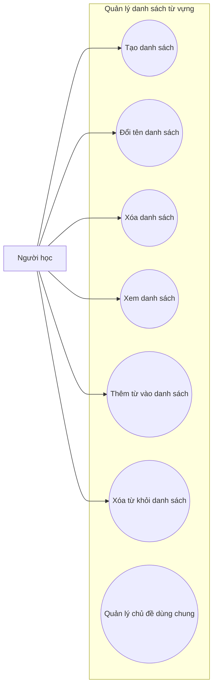
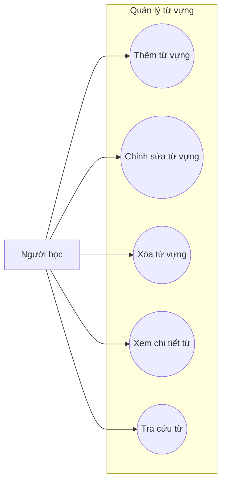
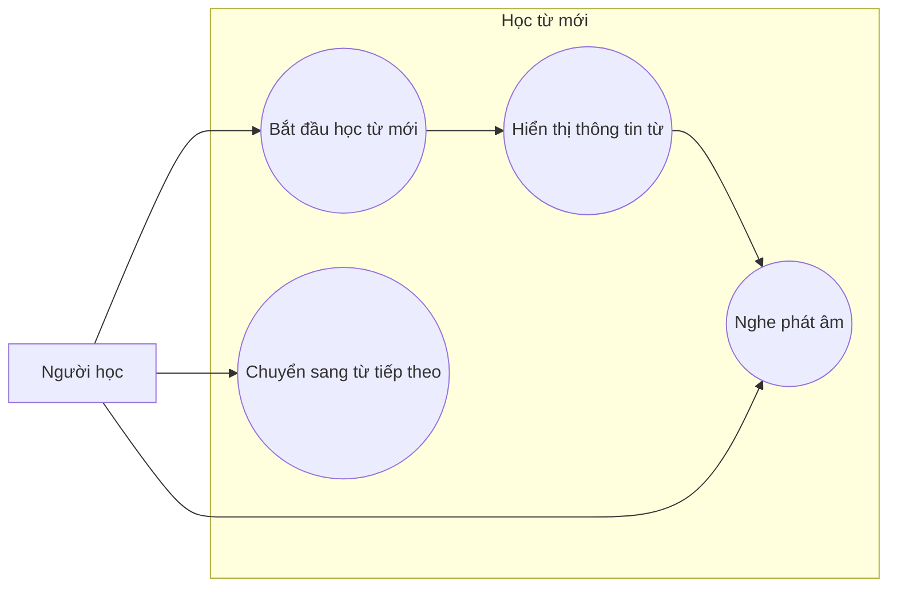
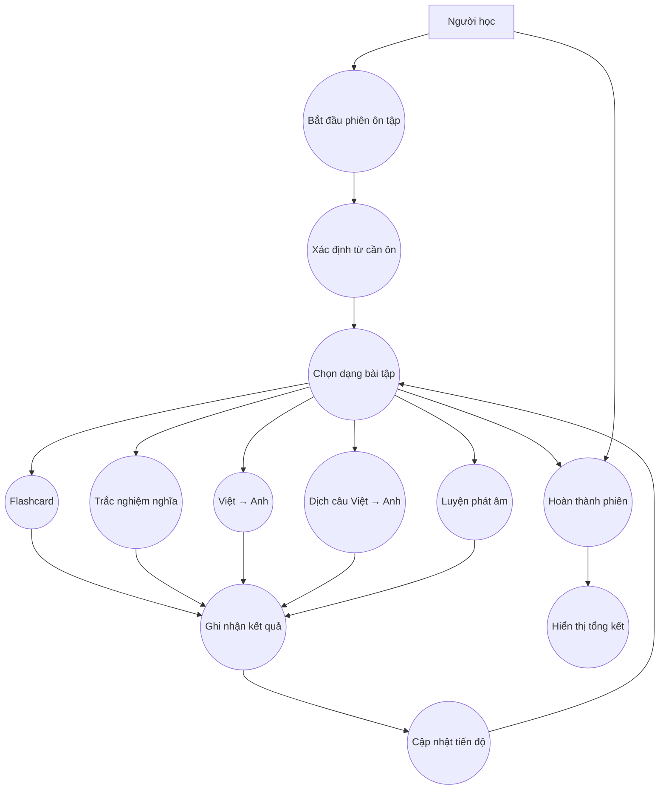
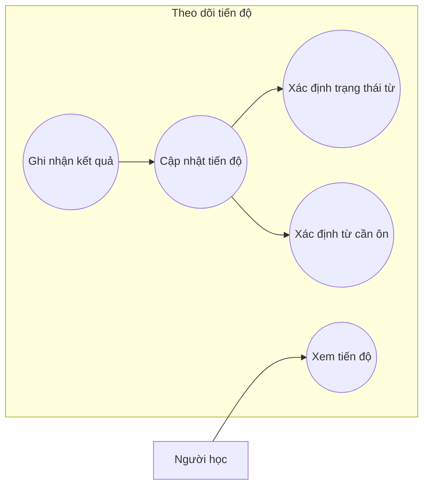
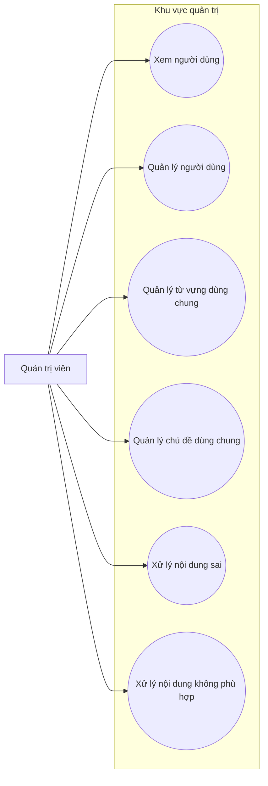
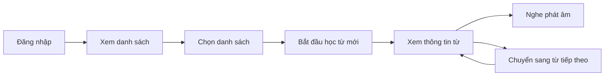
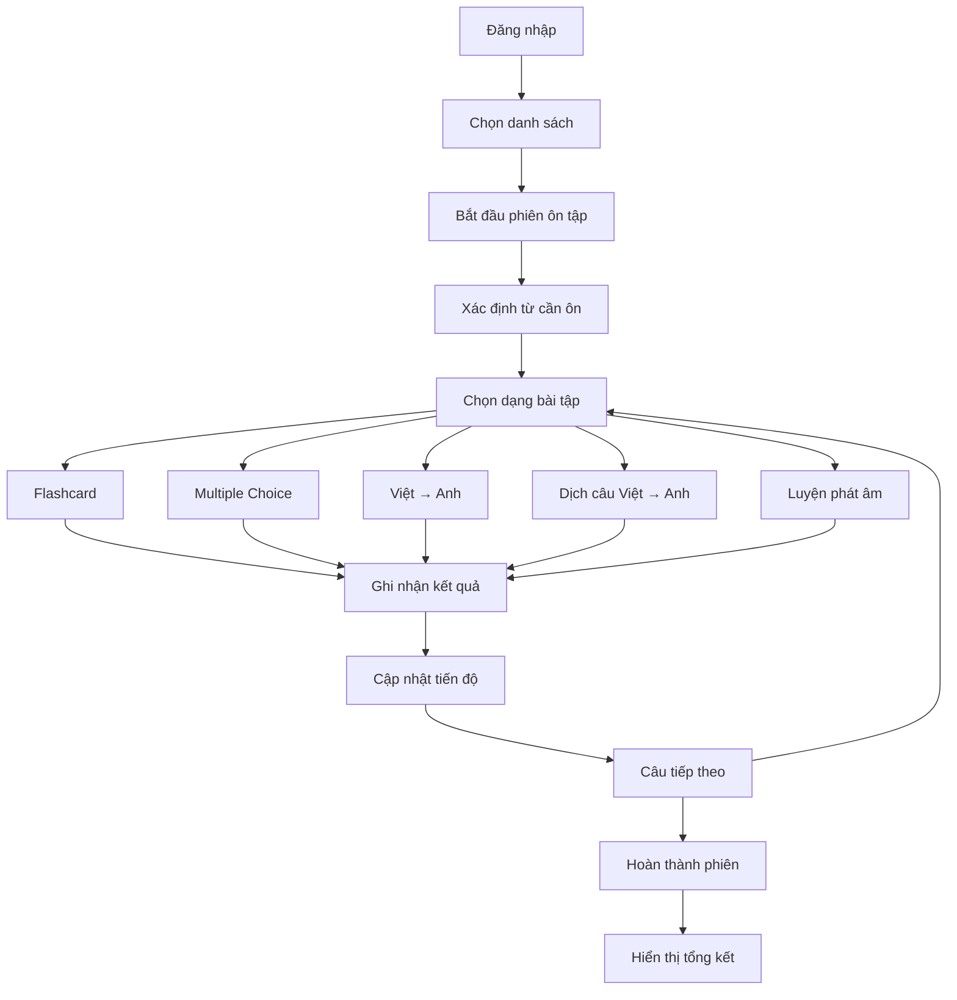
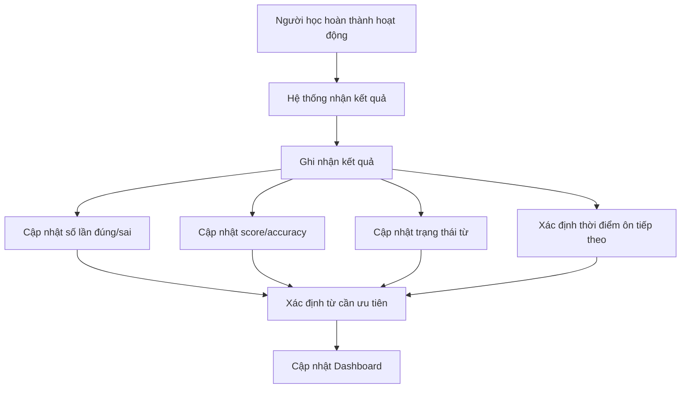

# USE CASE DOCUMENT

# WEBSITE HỌC VÀ ÔN TẬP TỪ VỰNG TIẾNG ANH

**Phiên bản:** 1.0  
**Trạng thái:** Draft for Review  
**Nguồn:** Software Requirements Specification (SRS) phiên bản 1.0  
**Vai trò soạn thảo:** Business Analyst

---

# 1. GIỚI THIỆU

## 1.1. Mục đích tài liệu

Use Case Document mô tả cách các Actor tương tác với Website học và ôn tập từ vựng tiếng Anh để hoàn thành các mục tiêu nghiệp vụ.

Tài liệu được xây dựng dựa trên SRS phiên bản 1.0 và được sử dụng làm cơ sở cho:

- Phân tích nghiệp vụ.
- Thiết kế UI/UX.
- Thiết kế hệ thống.
- Phát triển chức năng.
- Xây dựng Test Case.
- Kiểm thử và nghiệm thu.

Tài liệu tập trung vào:

> **Ai thực hiện? → Thực hiện chức năng gì? → Điều kiện gì? → Hệ thống phản hồi như thế nào?**

Tài liệu không đặc tả chi tiết về framework, database, API, kiến trúc mã nguồn hoặc hạ tầng triển khai.

## 1.2. Phạm vi

Các Use Case trong tài liệu bao gồm:

- Quản lý tài khoản.
- Quản lý danh sách từ vựng.
- Quản lý từ vựng.
- Học từ mới.
- Ôn tập bằng Flashcard.
- Trắc nghiệm nghĩa của từ.
- Việt → Anh.
- Dịch câu Việt → Anh.
- Nghe phát âm.
- Thực hiện phiên ôn tập.
- Theo dõi tiến độ.
- Xem Dashboard.
- Quản trị người dùng.
- Quản trị nội dung dùng chung.

## 1.3. Actor

| Actor | Mô tả |
|---|---|
| **Người học** | Người sử dụng hệ thống để quản lý, học và ôn tập từ vựng. |
| **Quản trị viên** | Người quản lý người dùng và nội dung dùng chung của hệ thống. |
| **Hệ thống** | Thực hiện các xử lý tự động như xác định kết quả, ghi nhận tiến độ, cập nhật trạng thái và tổng hợp kết quả. |

---

# 2. USE CASE MODEL

## 2.1. Tổng quan Use Case

```mermaid
flowchart LR
    User["Người học"]
    Admin["Quản trị viên"]

    subgraph System["Website học và ôn tập từ vựng tiếng Anh"]
        A1(("Đăng ký"))
        A2(("Đăng nhập"))
        A3(("Đăng xuất"))
        A4(("Quản lý hồ sơ"))
        A5(("Thay đổi mật khẩu"))
        A6(("Khôi phục mật khẩu"))
        A7(("Xóa tài khoản"))

        B1(("Quản lý danh sách"))
        B2(("Quản lý từ vựng"))

        C1(("Học từ mới"))
        C2(("Ôn tập Flashcard"))
        C3(("Trắc nghiệm nghĩa"))
        C4(("Việt → Anh"))
        C5(("Dịch câu Việt → Anh"))
        C6(("Nghe phát âm"))

        D1(("Bắt đầu phiên ôn tập"))
        D2(("Hoàn thành phiên ôn tập"))
        D3(("Theo dõi tiến độ"))
        D4(("Xem Dashboard"))

        E1(("Quản lý người dùng"))
        E2(("Quản lý từ vựng dùng chung"))
        E3(("Quản lý chủ đề dùng chung"))
        E4(("Xử lý nội dung sai / không phù hợp"))
    end

    User --> A1
    User --> A2
    User --> A3
    User --> A4
    User --> A5
    User --> A6
    User --> A7

    User --> B1
    User --> B2

    User --> C1
    User --> C2
    User --> C3
    User --> C4
    User --> C5
    User --> C6

    User --> D1
    User --> D2
    User --> D3
    User --> D4

    Admin --> A2
    Admin --> A3
    Admin --> E1
    Admin --> E2
    Admin --> E3
    Admin --> E4
```



## 2.2. Nhóm Use Case

| Nhóm | Use Case |
|---|---|
| Authentication | UC-AUTH-001 → UC-AUTH-007 |
| Vocabulary List | UC-LIST-001 → UC-LIST-007 |
| Vocabulary | UC-VOC-001 → UC-VOC-005 |
| Learning | UC-LEARN-001 → UC-LEARN-003 |
| Flashcard | UC-FLASH-001 |
| Multiple Choice | UC-MCQ-001 |
| Vietnamese → English | UC-V2E-001 |
| Sentence Translation | UC-SENT-001 |
| Pronunciation | UC-SPEECH-001 |
| Review Session | UC-SESSION-001 → UC-SESSION-004 |
| Progress | UC-PROGRESS-001 → UC-PROGRESS-002 |
| Dashboard | UC-DASH-001 |
| Administration | UC-ADMIN-001 → UC-ADMIN-004 |

---

# 3. QUẢN LÝ TÀI KHOẢN

## UC-AUTH-001 — Đăng ký tài khoản

**Actor chính:** Người học

**Mục tiêu:** Tạo một tài khoản mới để sử dụng hệ thống.

**Pre-condition:**

- Người dùng chưa đăng nhập.
- Người dùng chưa có tài khoản hợp lệ theo quy tắc định danh của hệ thống.

**Trigger:**

Người dùng chọn chức năng **Đăng ký**.

**Main Flow:**

1. Người dùng chọn Đăng ký.
2. Hệ thống hiển thị biểu mẫu đăng ký.
3. Người dùng nhập thông tin cần thiết.
4. Người dùng gửi biểu mẫu.
5. Hệ thống kiểm tra dữ liệu đầu vào.
6. Hệ thống kiểm tra tài khoản theo thông tin định danh.
7. Hệ thống tạo tài khoản.
8. Hệ thống thông báo đăng ký thành công.
9. Nếu hệ thống yêu cầu xác minh, hệ thống chuyển người dùng sang bước xác minh tương ứng.

**Alternative / Exception Flow:**

- A1. Dữ liệu không hợp lệ → hệ thống hiển thị lỗi.
- A2. Tài khoản đã tồn tại → hệ thống thông báo và không tạo tài khoản mới.
- A3. Không thể hoàn tất thao tác → hệ thống thông báo lỗi.

**Post-condition:**

- Tài khoản được tạo thành công nếu dữ liệu hợp lệ.

**Related Requirements:** FR-AUTH-001

---

## UC-AUTH-002 — Đăng nhập

**Actor chính:** Người học, Quản trị viên

**Mục tiêu:** Xác thực người dùng và cho phép truy cập các chức năng phù hợp.

**Pre-condition:**

- Người dùng đã có tài khoản.
- Người dùng chưa đăng nhập.

**Trigger:**

Người dùng chọn Đăng nhập.

**Main Flow:**

1. Người dùng nhập thông tin đăng nhập.
2. Người dùng gửi yêu cầu đăng nhập.
3. Hệ thống xác thực thông tin.
4. Hệ thống kiểm tra trạng thái tài khoản.
5. Hệ thống xác định vai trò người dùng.
6. Hệ thống cho phép đăng nhập.
7. Hệ thống chuyển người dùng đến khu vực phù hợp.

**Alternative / Exception Flow:**

- A1. Thông tin đăng nhập không hợp lệ → từ chối đăng nhập.
- A2. Tài khoản không được phép hoạt động → từ chối truy cập.

**Post-condition:**

Người dùng được xác thực và có thể sử dụng các chức năng được phép.

**Related Requirements:** FR-AUTH-002

---

## UC-AUTH-003 — Đăng xuất

**Actor chính:** Người học, Quản trị viên

**Mục tiêu:** Kết thúc phiên đăng nhập hiện tại.

**Pre-condition:**

- Người dùng đang đăng nhập.

**Main Flow:**

1. Người dùng chọn Đăng xuất.
2. Hệ thống kết thúc phiên đăng nhập.
3. Hệ thống đưa người dùng về trạng thái chưa đăng nhập.

**Post-condition:**

Người dùng không còn sử dụng các chức năng yêu cầu xác thực.

**Related Requirements:** FR-AUTH-003

---

## UC-AUTH-004 — Quản lý hồ sơ

**Actor chính:** Người học

**Mục tiêu:** Xem và cập nhật thông tin cá nhân được hệ thống cho phép.

**Pre-condition:**

- Người học đã đăng nhập.

**Main Flow:**

1. Người học mở trang hồ sơ.
2. Hệ thống hiển thị thông tin hồ sơ.
3. Người học chỉnh sửa thông tin được phép.
4. Người học gửi thay đổi.
5. Hệ thống kiểm tra dữ liệu.
6. Hệ thống lưu thay đổi.
7. Hệ thống thông báo kết quả.

**Alternative / Exception Flow:**

- A1. Dữ liệu không hợp lệ → hệ thống thông báo lỗi.
- A2. Trường thông tin không được phép chỉnh sửa → hệ thống không cho cập nhật.

**Post-condition:**

Thông tin hồ sơ được cập nhật nếu hợp lệ.

**Related Requirements:** FR-AUTH-004

**TBD:** Danh sách trường hồ sơ và quyền chỉnh sửa cụ thể.

---

## UC-AUTH-005 — Thay đổi mật khẩu

**Actor chính:** Người học

**Mục tiêu:** Thay đổi mật khẩu tài khoản.

**Pre-condition:**

- Người học đã đăng nhập.
- Người học đáp ứng yêu cầu xác thực theo chính sách hệ thống.

**Main Flow:**

1. Người học chọn Thay đổi mật khẩu.
2. Hệ thống hiển thị biểu mẫu.
3. Người học nhập thông tin cần thiết.
4. Người học gửi yêu cầu.
5. Hệ thống kiểm tra thông tin.
6. Hệ thống cập nhật mật khẩu.
7. Hệ thống thông báo kết quả.

**Alternative / Exception Flow:**

- A1. Thông tin không hợp lệ → từ chối thay đổi.
- A2. Không đáp ứng yêu cầu xác thực → từ chối thao tác.

**Related Requirements:** FR-AUTH-005

**TBD:** Chính sách mật khẩu và xác minh lại danh tính.

---

## UC-AUTH-006 — Khôi phục mật khẩu

**Actor chính:** Người học

**Mục tiêu:** Khôi phục quyền truy cập khi người học quên mật khẩu.

**Pre-condition:**

- Người dùng không thể sử dụng mật khẩu hiện tại.

**Main Flow:**

1. Người dùng chọn Khôi phục mật khẩu.
2. Hệ thống yêu cầu thông tin xác định tài khoản.
3. Người dùng cung cấp thông tin.
4. Hệ thống xác minh yêu cầu.
5. Hệ thống thực hiện cơ chế khôi phục.
6. Người dùng thiết lập mật khẩu mới.
7. Hệ thống thông báo kết quả.

**Alternative / Exception Flow:**

- A1. Không xác định được tài khoản → thông báo phù hợp.
- A2. Xác minh không thành công → không cho phép khôi phục.
- A3. Yêu cầu không còn hợp lệ → yêu cầu thực hiện lại.

**Related Requirements:** FR-AUTH-006

**TBD:** Cơ chế xác minh, thời hạn mã/liên kết và giới hạn yêu cầu.

---

## UC-AUTH-007 — Xóa tài khoản

**Actor chính:** Người học

**Mục tiêu:** Yêu cầu xóa tài khoản.

**Pre-condition:**

- Người học đã đăng nhập.

**Main Flow:**

1. Người học mở chức năng xóa tài khoản.
2. Hệ thống hiển thị thông tin/cảnh báo liên quan.
3. Người học xác nhận yêu cầu.
4. Hệ thống xử lý yêu cầu xóa.
5. Hệ thống thông báo kết quả.

**Alternative / Exception Flow:**

- A1. Người học hủy xác nhận → không xóa tài khoản.
- A2. Không thể xử lý yêu cầu → thông báo lỗi.

**Post-condition:**

Tài khoản được xử lý theo chính sách xóa tài khoản.

**Related Requirements:** FR-AUTH-007

**TBD:** Chính sách xử lý dữ liệu lịch sử học tập.

---

# 4. QUẢN LÝ DANH SÁCH TỪ VỰNG

## 4.1. Use Case Diagram



> **Lưu ý:** Quản lý chủ đề dùng chung thuộc quyền của Admin và được đặc tả ở nhóm Administration.

---

## UC-LIST-001 — Tạo danh sách

**Actor chính:** Người học

**Pre-condition:**

- Người học đã đăng nhập.

**Main Flow:**

1. Người học chọn Tạo danh sách.
2. Hệ thống hiển thị biểu mẫu.
3. Người học nhập tên danh sách.
4. Người học xác nhận.
5. Hệ thống kiểm tra tên danh sách.
6. Hệ thống tạo danh sách.
7. Hệ thống thông báo thành công.

**Post-condition:**

Danh sách mới thuộc quyền quản lý của người tạo.

**Related Requirements:** FR-LIST-001

---

## UC-LIST-002 — Đổi tên danh sách

**Actor chính:** Người học

**Pre-condition:**

- Người học đã đăng nhập.
- Danh sách thuộc phạm vi người học có quyền quản lý.

**Main Flow:**

1. Người học chọn danh sách.
2. Chọn Đổi tên.
3. Nhập tên mới.
4. Hệ thống kiểm tra dữ liệu.
5. Hệ thống cập nhật tên.
6. Hệ thống thông báo kết quả.

**Related Requirements:** FR-LIST-002

---

## UC-LIST-003 — Xóa danh sách

**Actor chính:** Người học

**Pre-condition:**

- Danh sách thuộc quyền quản lý của người học.

**Main Flow:**

1. Người học chọn danh sách.
2. Chọn Xóa.
3. Hệ thống yêu cầu xác nhận.
4. Người học xác nhận.
5. Hệ thống xử lý xóa danh sách.
6. Hệ thống thông báo kết quả.

**Alternative / Exception Flow:**

- A1. Người học hủy → không xóa.
- A2. Không đủ quyền → từ chối thao tác.

**Business Rule:**

Việc xóa danh sách không được làm ảnh hưởng ngoài phạm vi dữ liệu người dùng sở hữu, trừ khi có quy định khác.

**Related Requirements:** FR-LIST-003

---

## UC-LIST-004 — Xem danh sách

**Actor chính:** Người học

**Pre-condition:**

- Người học đã đăng nhập.

**Main Flow:**

1. Người học mở danh sách.
2. Hệ thống xác định các danh sách người học có quyền truy cập.
3. Hệ thống hiển thị danh sách.
4. Người học chọn một danh sách để xem chi tiết.

**Related Requirements:** FR-LIST-004

---

## UC-LIST-005 — Thêm từ vào danh sách

**Actor chính:** Người học

**Pre-condition:**

- Người học đã đăng nhập.
- Danh sách tồn tại.
- Người học có quyền chỉnh sửa danh sách.

**Main Flow:**

1. Người học mở danh sách.
2. Chọn chức năng thêm từ.
3. Người học chọn hoặc nhập từ vựng.
4. Hệ thống kiểm tra dữ liệu.
5. Hệ thống thêm từ vào danh sách.
6. Hệ thống thông báo kết quả.

**Related Requirements:** FR-LIST-005

---

## UC-LIST-006 — Xóa từ khỏi danh sách

**Actor chính:** Người học

**Pre-condition:**

- Người học có quyền chỉnh sửa danh sách.
- Từ đang thuộc danh sách.

**Main Flow:**

1. Người học mở danh sách.
2. Chọn từ muốn loại bỏ.
3. Chọn Xóa khỏi danh sách.
4. Hệ thống xác nhận yêu cầu.
5. Hệ thống loại bỏ từ khỏi danh sách.
6. Hệ thống thông báo kết quả.

**Related Requirements:** FR-LIST-006

**TBD:** Xóa bản ghi từ vựng hay chỉ xóa liên kết giữa từ và danh sách.

---

# 5. QUẢN LÝ TỪ VỰNG

## 5.1. Use Case Diagram



## UC-VOC-001 — Thêm từ vựng

**Actor chính:** Người học

**Pre-condition:**

- Người học đã đăng nhập.
- Người học có quyền chỉnh sửa danh sách.

**Main Flow:**

1. Người học mở danh sách.
2. Chọn Thêm từ vựng.
3. Nhập thông tin từ.
4. Hệ thống kiểm tra dữ liệu.
5. Hệ thống tạo từ vựng.
6. Hệ thống liên kết từ với danh sách.
7. Hệ thống thông báo kết quả.

**Thông tin có thể bao gồm:**

- Từ tiếng Anh.
- Nghĩa tiếng Việt.
- Từ loại.
- Câu ví dụ tiếng Anh.
- Câu ví dụ tiếng Việt.
- Phiên âm.
- Phát âm.
- Thông tin bổ sung.

**Related Requirements:** FR-VOC-001

---

## UC-VOC-002 — Chỉnh sửa từ vựng

**Actor chính:** Người học

**Pre-condition:**

- Từ tồn tại.
- Người học có quyền chỉnh sửa.

**Main Flow:**

1. Người học mở chi tiết từ.
2. Chọn Chỉnh sửa.
3. Cập nhật thông tin.
4. Hệ thống kiểm tra dữ liệu.
5. Hệ thống lưu thay đổi.
6. Hệ thống hiển thị kết quả.

**Related Requirements:** FR-VOC-002

---

## UC-VOC-003 — Xóa từ vựng

**Actor chính:** Người học

**Pre-condition:**

- Người học có quyền thao tác với từ.

**Main Flow:**

1. Người học chọn từ.
2. Chọn Xóa.
3. Hệ thống yêu cầu xác nhận.
4. Người học xác nhận.
5. Hệ thống xử lý yêu cầu.
6. Hệ thống thông báo kết quả.

**Related Requirements:** FR-VOC-003

---

## UC-VOC-004 — Xem chi tiết từ

**Actor chính:** Người học

**Main Flow:**

1. Người học chọn một từ.
2. Hệ thống hiển thị thông tin chi tiết.
3. Người học có thể xem nghĩa, từ loại, ví dụ, phiên âm và thông tin phát âm.

**Related Requirements:** FR-VOC-004

---

## UC-VOC-005 — Tra cứu từ

**Actor chính:** Người học

**Main Flow:**

1. Người học nhập nội dung cần tìm.
2. Hệ thống xử lý yêu cầu tìm kiếm.
3. Hệ thống hiển thị các từ phù hợp.
4. Người học chọn từ cần xem.

**Related Requirements:** FR-VOC-005

**TBD:** Quy tắc tìm kiếm cụ thể.

---

# 6. HỌC TỪ MỚI

## 6.1. Use Case Diagram



## UC-LEARN-001 — Bắt đầu học từ mới

**Actor chính:** Người học

**Pre-condition:**

- Người học đã đăng nhập.
- Có danh sách hợp lệ.

**Main Flow:**

1. Người học chọn danh sách.
2. Người học chọn Học từ mới.
3. Hệ thống xác định các từ phù hợp.
4. Hệ thống hiển thị từ đầu tiên.
5. Người học bắt đầu học.

**Post-condition:**

Phiên học được bắt đầu và người học có thể xem nội dung từ.

**Related Requirements:** FR-LEARN-001

---

## UC-LEARN-002 — Xem thông tin từ khi học

**Actor chính:** Người học

**Main Flow:**

1. Hệ thống hiển thị từ tiếng Anh.
2. Hệ thống hiển thị nghĩa.
3. Hệ thống hiển thị từ loại nếu có.
4. Hệ thống hiển thị phiên âm.
5. Hệ thống hiển thị câu ví dụ.
6. Người học có thể nghe phát âm.

**Related Requirements:** FR-LEARN-002

---

## UC-LEARN-003 — Chuyển sang từ tiếp theo

**Actor chính:** Người học

**Main Flow:**

1. Người học hoàn thành việc xem từ hiện tại.
2. Người học chọn từ tiếp theo.
3. Hệ thống xác định từ tiếp theo.
4. Hệ thống hiển thị từ mới.

**Related Requirements:** FR-LEARN-003

**TBD:** Quy tắc xác định thứ tự từ.

---

# 7. ÔN TẬP BẰNG FLASHCARD

## UC-FLASH-001 — Ôn tập bằng Flashcard

**Actor chính:** Người học

**Mục tiêu:** Kiểm tra khả năng nhớ từ bằng cách chủ động truy xuất nghĩa của từ.

**Pre-condition:**

- Người học đã đăng nhập.
- Có từ phù hợp để ôn.

**Main Flow:**

1. Người học bắt đầu Flashcard.
2. Hệ thống hiển thị từ tiếng Anh ở mặt trước.
3. Người học cố gắng nhớ nghĩa.
4. Người học chọn Lật thẻ.
5. Hệ thống hiển thị nghĩa/đáp án.
6. Người học đánh giá khả năng nhớ:
   - Nhớ.
   - Không nhớ.
   - Khó nhớ.
7. Hệ thống ghi nhận kết quả.
8. Hệ thống cập nhật tiến độ.
9. Hệ thống chuyển sang từ tiếp theo.

**Alternative Flow:**

- A1. Người học kết thúc phiên → hệ thống tổng hợp kết quả hiện tại.
- A2. Không có từ phù hợp → hệ thống thông báo trạng thái.

**Post-condition:**

Kết quả đánh giá được ghi nhận và có thể ảnh hưởng đến tiến độ.

**Related Requirements:** FR-REVIEW-FLASH-001 → FR-REVIEW-FLASH-004

---

# 8. TRẮC NGHIỆM NGHĨA CỦA TỪ

## UC-MCQ-001 — Làm trắc nghiệm nghĩa

**Actor chính:** Người học

**Mục tiêu:** Kiểm tra khả năng nhận biết nghĩa của từ tiếng Anh.

**Pre-condition:**

- Có từ mục tiêu.
- Có thể tạo câu hỏi hợp lệ.

**Main Flow:**

1. Hệ thống chọn một từ mục tiêu.
2. Hệ thống tạo câu hỏi.
3. Hệ thống hiển thị từ tiếng Anh.
4. Hệ thống hiển thị các phương án nghĩa tiếng Việt.
5. Người học chọn một phương án.
6. Hệ thống kiểm tra câu trả lời.
7. Hệ thống xác định đúng/sai.
8. Hệ thống hiển thị đáp án đúng.
9. Hệ thống ghi nhận kết quả.
10. Hệ thống cập nhật tiến độ.

**Business Rules:**

- Mỗi câu hỏi phải có đúng một đáp án đúng.
- Phương án sai phải hợp lý.
- Hệ thống nên tránh để đáp án đúng liên tục ở cùng vị trí.

**Alternative Flow:**

- A1. Câu hỏi không hợp lệ → hệ thống không sử dụng câu hỏi.
- A2. Người học chưa chọn đáp án → yêu cầu chọn đáp án.

**Related Requirements:** FR-QUIZ-MCQ-001 → FR-QUIZ-MCQ-003, BR-QUIZ-001, BR-QUIZ-002

---

# 9. VIỆT → ANH

## UC-V2E-001 — Dịch từ Việt → Anh

**Actor chính:** Người học

**Mục tiêu:** Kiểm tra khả năng nhớ từ tiếng Anh dựa trên nghĩa tiếng Việt.

**Pre-condition:**

- Có từ mục tiêu.

**Main Flow:**

1. Hệ thống chọn từ mục tiêu.
2. Hệ thống hiển thị nghĩa tiếng Việt.
3. Người học nhập từ tiếng Anh.
4. Người học gửi câu trả lời.
5. Hệ thống kiểm tra câu trả lời.
6. Hệ thống xác định đúng/sai.
7. Hệ thống ghi nhận kết quả.
8. Hệ thống cập nhật tiến độ.

**Alternative Flow:**

- A1. Câu trả lời không hợp lệ → hệ thống yêu cầu nhập lại hoặc thông báo kết quả theo quy tắc.
- A2. Câu trả lời không khớp → đánh dấu sai.

**Related Requirements:** FR-QUIZ-V2E-001 → FR-QUIZ-V2E-002

**TBD:**

- Không phân biệt hoa/thường.
- Khoảng trắng thừa.
- Biến thể từ.
- Lỗi chính tả gần đúng.
- Từ đồng nghĩa.

---

# 10. DỊCH CÂU VIỆT → ANH

## UC-SENT-001 — Dịch câu Việt → Anh

**Actor chính:** Người học

**Mục tiêu:** Kiểm tra khả năng sử dụng từ mục tiêu trong ngữ cảnh.

**Pre-condition:**

- Có từ mục tiêu.
- Có câu tiếng Việt hợp lệ gắn với từ mục tiêu.

**Main Flow:**

1. Hệ thống chọn từ mục tiêu.
2. Hệ thống hiển thị câu tiếng Việt.
3. Người học nhập câu tiếng Anh.
4. Người học gửi câu trả lời.
5. Hệ thống đánh giá câu trả lời theo quy tắc phiên bản 1.0.
6. Hệ thống hiển thị câu trả lời tham khảo.
7. Hệ thống ghi nhận kết quả.
8. Hệ thống cập nhật tiến độ của từ mục tiêu.

**Alternative Flow:**

- A1. Người học không nhập câu trả lời → hệ thống yêu cầu nhập.
- A2. Câu trả lời không đạt quy tắc → hệ thống ghi nhận kết quả tương ứng.

**Related Requirements:** FR-QUIZ-SENT-001 → FR-QUIZ-SENT-005

**TBD:** Cơ chế chấm điểm và ngưỡng đúng/sai.

---

# 11. NGHE PHÁT ÂM

## UC-SPEECH-001 — Nghe phát âm

**Actor chính:** Người học

**Mục tiêu:** Cho phép người học nghe cách phát âm của từ.

**Pre-condition:**

- Từ có thông tin phát âm/audio.

**Main Flow:**

1. Người học mở từ.
2. Hệ thống hiển thị phiên âm.
3. Người học chọn nút nghe phát âm.
4. Hệ thống cung cấp audio.
5. Người học nghe phát âm.

**Alternative Flow:**

- A1. Không thể phát audio → hệ thống thông báo lỗi.
- A2. Hệ thống không có audio → hệ thống thông báo trạng thái phù hợp.

**Post-condition:**

Trạng thái học tập hiện tại không bị mất nếu audio xảy ra lỗi.

**Related Requirements:** FR-SPEECH-001 → FR-SPEECH-003

**TBD:** Chuẩn phát âm và lựa chọn giọng.

---

# 12. PHIÊN ÔN TẬP

## 12.1. Use Case Diagram



## UC-SESSION-001 — Bắt đầu phiên ôn tập

**Actor chính:** Người học

**Pre-condition:**

- Người học đã đăng nhập.
- Có danh sách hoặc tập từ hợp lệ.

**Main Flow:**

1. Người học chọn danh sách.
2. Người học chọn Ôn tập.
3. Hệ thống xác định các từ phù hợp để ôn.
4. Hệ thống tạo phiên ôn tập.
5. Hệ thống đưa người học vào phiên.

**Alternative Flow:**

- A1. Không có từ cần ôn → hệ thống thông báo và không tạo phiên rỗng.

**Related Requirements:** FR-SESSION-001, FR-SESSION-002

---

## UC-SESSION-002 — Chọn dạng bài tập

**Actor chính:** Người học

**Main Flow:**

1. Hệ thống cung cấp các dạng bài tập trong phạm vi phiên bản 1.0.
2. Người học chọn dạng bài.
3. Hệ thống tạo câu hỏi phù hợp với từ mục tiêu.
4. Hệ thống hiển thị câu hỏi.

Các dạng bài bao gồm:

- Flashcard.
- Multiple Choice.
- Việt → Anh.
- Dịch câu Việt → Anh.
- Luyện phát âm.

**Related Requirements:** FR-SESSION-003

---

## UC-SESSION-003 — Ghi nhận kết quả từng câu

**Actor chính:** Người học  
**Hệ thống:** Xử lý kết quả

**Main Flow:**

1. Người học thực hiện bài tập.
2. Người học gửi câu trả lời hoặc đánh giá.
3. Hệ thống xác định kết quả.
4. Hệ thống ghi nhận kết quả của câu.
5. Hệ thống cập nhật tiến độ tương ứng.
6. Hệ thống chuyển sang câu tiếp theo.

**Business Rule:**

Mỗi câu hỏi trong phiên phải được ghi nhận kết quả riêng biệt.

**Related Requirements:** FR-SESSION-004, BR-005, BR-006

---

## UC-SESSION-004 — Hoàn thành phiên ôn tập

**Actor chính:** Người học

**Main Flow:**

1. Người học hoàn thành các câu hỏi.
2. Hệ thống xác định phiên đã kết thúc.
3. Hệ thống tổng hợp kết quả.
4. Hệ thống cập nhật tiến độ.
5. Hệ thống xác định các từ cần chú ý.
6. Hệ thống hiển thị kết quả phiên.

**Kết quả có thể bao gồm:**

- Tổng số câu.
- Số câu đúng.
- Số câu sai.
- Tỷ lệ chính xác.
- Các từ cần chú ý.
- Trạng thái tiến độ.

**Related Requirements:** FR-SESSION-005, FR-SESSION-006

---

# 13. THEO DÕI TIẾN ĐỘ

## 13.1. Use Case Diagram



## UC-PROGRESS-001 — Ghi nhận kết quả học tập

**Actor chính:** Hệ thống

**Trigger:**

Người học hoàn thành một hoạt động học/ôn tập.

**Main Flow:**

1. Hệ thống nhận kết quả hoạt động.
2. Hệ thống xác định từ mục tiêu.
3. Hệ thống ghi nhận kết quả.
4. Hệ thống cập nhật các chỉ số liên quan.
5. Hệ thống cập nhật tiến độ của từ.

Các dữ liệu có thể được theo dõi:

- Số lần ôn.
- Số lần đúng.
- Số lần sai.
- Điểm/tỷ lệ chính xác.
- Lần ôn gần nhất.
- Lần ôn tiếp theo.

**Related Requirements:** FR-PROGRESS-001, FR-PROGRESS-002

---

## UC-PROGRESS-002 — Xác định từ cần ôn

**Actor chính:** Hệ thống

**Mục tiêu:** Xác định các từ nên được ưu tiên ôn tập.

**Trigger:**

- Người học bắt đầu phiên ôn tập.
- Hệ thống cần cập nhật danh sách từ cần ôn.
- Dashboard cần hiển thị số từ cần ôn.

**Main Flow:**

1. Hệ thống lấy thông tin tiến độ.
2. Hệ thống xem xét lịch sử học tập.
3. Hệ thống xác định các từ có mức độ ưu tiên cao.
4. Hệ thống trả về tập từ cần ôn.

**Các tín hiệu cần xem xét:**

- Trả lời sai nhiều lần.
- Được đánh giá “Khó nhớ”.
- Đã lâu chưa được ôn.
- Vừa học nhưng chưa đạt mức ghi nhớ mong muốn.

**Related Requirements:** BR-PROGRESS-001, BR-PROGRESS-002, BR-007

**TBD:** Công thức ưu tiên và thuật toán spaced repetition.

---

# 14. DASHBOARD

## UC-DASH-001 — Xem Dashboard học tập

**Actor chính:** Người học

**Pre-condition:**

- Người học đã đăng nhập.

**Main Flow:**

1. Người học mở Dashboard.
2. Hệ thống lấy dữ liệu học tập.
3. Hệ thống tính/tổng hợp các chỉ số.
4. Hệ thống hiển thị Dashboard.

**Thông tin có thể hiển thị:**

- Tổng số từ đã học.
- Số từ cần ôn hôm nay.
- Số từ đã ghi nhớ.
- Tiến độ theo danh sách/chủ đề.
- Điểm hoặc tỷ lệ chính xác gần đây.
- Learning Streak.
- Các phiên ôn gần nhất.

**Post-condition:**

Người học có được tổng quan về tình trạng học tập hiện tại.

**Related Requirements:** FR-DASH-001, FR-DASH-002

**TBD:**

- Công thức streak.
- Khoảng thời gian của Recent Accuracy.
- Định nghĩa “đã học”.
- Cách tính “cần ôn hôm nay”.

---

# 15. QUẢN TRỊ HỆ THỐNG

## 15.1. Use Case Diagram



## UC-ADMIN-001 — Xem người dùng

**Actor chính:** Quản trị viên

**Pre-condition:**

- Quản trị viên đã đăng nhập.
- Có quyền truy cập khu vực quản trị.

**Main Flow:**

1. Quản trị viên mở khu vực quản lý người dùng.
2. Hệ thống xác thực quyền.
3. Hệ thống lấy danh sách người dùng.
4. Hệ thống hiển thị danh sách.
5. Quản trị viên có thể chọn một người dùng để xem thông tin.

**Related Requirements:** FR-ADMIN-USER-001

---

## UC-ADMIN-002 — Quản lý người dùng

**Actor chính:** Quản trị viên

**Pre-condition:**

- Quản trị viên đã đăng nhập.
- Có quyền quản lý người dùng.

**Main Flow:**

1. Quản trị viên mở danh sách người dùng.
2. Chọn người dùng cần quản lý.
3. Chọn thao tác được phép.
4. Hệ thống kiểm tra quyền.
5. Hệ thống kiểm tra dữ liệu.
6. Hệ thống thực hiện thay đổi.
7. Hệ thống thông báo kết quả.

**Related Requirements:** FR-ADMIN-USER-002

**TBD:** Các thao tác cụ thể như khóa/mở khóa, chỉnh sửa, xóa, tìm kiếm và lọc.

---

## UC-ADMIN-003 — Quản lý nội dung dùng chung

**Actor chính:** Quản trị viên

**Mục tiêu:** Quản lý từ vựng và chủ đề dùng chung của hệ thống.

**Main Flow:**

1. Quản trị viên mở khu vực quản lý nội dung.
2. Chọn loại nội dung:
   - Từ vựng dùng chung.
   - Chủ đề dùng chung.
3. Hệ thống hiển thị dữ liệu.
4. Quản trị viên tạo, xem hoặc cập nhật nội dung.
5. Hệ thống kiểm tra dữ liệu.
6. Hệ thống lưu thay đổi.
7. Hệ thống thông báo kết quả.

**Related Requirements:**

- FR-ADMIN-CONTENT-001
- FR-ADMIN-CONTENT-002

---

## UC-ADMIN-004 — Xử lý nội dung sai hoặc không phù hợp

**Actor chính:** Quản trị viên

**Mục tiêu:** Xử lý nội dung sai hoặc không phù hợp với chính sách vận hành.

**Pre-condition:**

- Quản trị viên đã đăng nhập.
- Quản trị viên có quyền xử lý nội dung.

**Main Flow:**

1. Quản trị viên xác định nội dung cần xử lý.
2. Quản trị viên xem nội dung.
3. Quản trị viên xác định vấn đề.
4. Quản trị viên thực hiện thao tác được phép.
5. Hệ thống kiểm tra thao tác.
6. Hệ thống cập nhật nội dung/trạng thái.
7. Hệ thống thông báo kết quả.

**Related Requirements:** FR-ADMIN-CONTENT-003

**TBD:** Quy trình và trạng thái xử lý nội dung.

---

# 16. MỐI QUAN HỆ GIỮA CÁC USE CASE

## 16.1. Luồng học từ mới



## 16.2. Luồng ôn tập



## 16.3. Luồng cập nhật tiến độ



**Lưu ý:** Công thức cụ thể để chuyển trạng thái và tính thời điểm ôn tiếp theo vẫn là **TBD** trong SRS. Không nên tự ý đưa thuật toán Spaced Repetition cụ thể vào Use Case Document.

---

# 17. PRE-CONDITION VÀ POST-CONDITION CHUNG

## 17.1. Người học

Các Use Case yêu cầu tài khoản phải tuân thủ:

```text
Người dùng
    ↓
Đã đăng nhập?
    ├── Không → Yêu cầu đăng nhập
    └── Có
         ↓
    Kiểm tra quyền
         ↓
    Thực hiện Use Case
```

Người học chỉ được quản lý dữ liệu nằm trong phạm vi quyền của mình hoặc nội dung dùng chung được hệ thống cho phép.

## 17.2. Quản trị viên

Các Use Case quản trị phải tuân thủ:

```text
Admin
  ↓
Đã đăng nhập?
  ↓
Kiểm tra quyền quản trị
  ↓
Cho phép truy cập
  ↓
Thực hiện thao tác
```

Nếu không có quyền phù hợp, hệ thống phải từ chối thao tác.

---

# 18. BUSINESS RULES LIÊN QUAN ĐẾN USE CASE

| ID | Business Rule | Use Case liên quan |
|---|---|---|
| BR-001 | Người học chỉ quản lý dữ liệu thuộc phạm vi quyền | UC-LIST-*, UC-VOC-* |
| BR-002 | Mỗi câu hỏi phải gắn với từ mục tiêu | UC-MCQ-001, UC-V2E-001, UC-SENT-001 |
| BR-003 | Multiple Choice có đúng một đáp án | UC-MCQ-001 |
| BR-004 | Phương án sai phải hợp lý | UC-MCQ-001 |
| BR-005 | Kết quả hoạt động phải được ghi nhận | UC-FLASH-001, UC-MCQ-001, UC-V2E-001, UC-SENT-001 |
| BR-006 | Kết quả có thể ảnh hưởng trạng thái từ | UC-PROGRESS-001 |
| BR-007 | Hệ thống xác định từ cần ưu tiên ôn | UC-PROGRESS-002 |
| BR-008 | Phiên ôn phải có tập từ, câu hỏi, kết quả và tổng hợp | UC-SESSION-* |
| BR-009 | Từ phải có thông tin phát âm tương ứng | UC-SPEECH-001 |
| BR-010 | Hệ thống hỗ trợ New, Learning, Review, Mastered | UC-PROGRESS-* |

---

# 19. TRACEABILITY — USE CASE → SRS

| Use Case | SRS Requirement |
|---|---|
| UC-AUTH-001 | FR-AUTH-001 |
| UC-AUTH-002 | FR-AUTH-002 |
| UC-AUTH-003 | FR-AUTH-003 |
| UC-AUTH-004 | FR-AUTH-004 |
| UC-AUTH-005 | FR-AUTH-005 |
| UC-AUTH-006 | FR-AUTH-006 |
| UC-AUTH-007 | FR-AUTH-007 |
| UC-LIST-001 | FR-LIST-001 |
| UC-LIST-002 | FR-LIST-002 |
| UC-LIST-003 | FR-LIST-003 |
| UC-LIST-004 | FR-LIST-004 |
| UC-LIST-005 | FR-LIST-005 |
| UC-LIST-006 | FR-LIST-006 |
| UC-VOC-001 | FR-VOC-001 |
| UC-VOC-002 | FR-VOC-002 |
| UC-VOC-003 | FR-VOC-003 |
| UC-VOC-004 | FR-VOC-004 |
| UC-VOC-005 | FR-VOC-005 |
| UC-LEARN-001 | FR-LEARN-001 |
| UC-LEARN-002 | FR-LEARN-002 |
| UC-LEARN-003 | FR-LEARN-003 |
| UC-FLASH-001 | FR-REVIEW-FLASH-* |
| UC-MCQ-001 | FR-QUIZ-MCQ-* |
| UC-V2E-001 | FR-QUIZ-V2E-* |
| UC-SENT-001 | FR-QUIZ-SENT-* |
| UC-SPEECH-001 | FR-SPEECH-* |
| UC-SESSION-001 | FR-SESSION-001 → FR-SESSION-002 |
| UC-SESSION-002 | FR-SESSION-003 |
| UC-SESSION-003 | FR-SESSION-004 |
| UC-SESSION-004 | FR-SESSION-005 → FR-SESSION-006 |
| UC-PROGRESS-001 | FR-PROGRESS-001 → FR-PROGRESS-003 |
| UC-PROGRESS-002 | BR-PROGRESS-001 → BR-PROGRESS-002 |
| UC-DASH-001 | FR-DASH-001 → FR-DASH-002 |
| UC-ADMIN-001 | FR-ADMIN-USER-001 |
| UC-ADMIN-002 | FR-ADMIN-USER-002 |
| UC-ADMIN-003 | FR-ADMIN-CONTENT-001 → FR-ADMIN-CONTENT-002 |
| UC-ADMIN-004 | FR-ADMIN-CONTENT-003 |

---

# 20. OPEN ISSUES / TBD

Use Case Document không tự quyết định các vấn đề mà SRS đang đánh dấu TBD.

Các vấn đề cần được Product Owner/BA xác nhận trước khi chuyển sang thiết kế chi tiết:

### Tài khoản

1. Các trường thông tin đăng ký.
2. Chính sách mật khẩu.
3. Cơ chế xác minh tài khoản.
4. Cơ chế khôi phục mật khẩu.
5. Chính sách xóa tài khoản.

### Danh sách và từ vựng

6. Một từ có thể thuộc nhiều danh sách hay không.
7. Quan hệ giữa List và Topic.
8. Các trường bắt buộc của Vocabulary.
9. Cho phép trùng từ hay không.
10. Xóa từ là xóa bản ghi hay xóa liên kết.

### Chấm điểm

11. Quy tắc chấm Việt → Anh.
12. Xử lý hoa/thường.
13. Xử lý khoảng trắng.
14. Biến thể từ.
15. Đồng nghĩa.
16. Cơ chế đánh giá câu dịch.

### Phát âm

17. Chuẩn giọng.
18. Số lượng giọng.
19. Nguồn audio.

### Progress / Review

20. Công thức Score/Accuracy.
21. Điều kiện New → Learning.
22. Điều kiện Learning → Review.
23. Điều kiện Review → Mastered.
24. Công thức Next Review.
25. Quy tắc ưu tiên từ.

### Dashboard

26. Công thức Learning Streak.
27. Khoảng thời gian Recent Accuracy.
28. Định nghĩa “đã học”.
29. Định nghĩa “cần ôn hôm nay”.

### Administration

30. Các thao tác Admin cụ thể.
31. Quy trình xử lý nội dung sai.
32. Trạng thái xử lý nội dung.

---

# 21. KẾT LUẬN

Use Case Document này chuyển các Functional Requirements trong SRS thành các tương tác cụ thể giữa Actor và hệ thống.

Luồng nghiệp vụ cốt lõi của hệ thống được xác định là:

```text
Đăng nhập
    ↓
Quản lý danh sách
    ↓
Học từ mới
    ↓
Ôn tập
    ↓
Trả lời / Đánh giá
    ↓
Ghi nhận kết quả
    ↓
Cập nhật tiến độ
    ↓
Xác định từ cần ôn
    ↓
Dashboard
    ↓
Ôn tập tiếp
```

Mô hình này phản ánh nguyên tắc nghiệp vụ của sản phẩm:

> **Learn → Recall → Practice → Review**

Use Case Document là cơ sở để chuyển sang các tài liệu thiết kế tiếp theo như **UI/UX Design, System Design, Database Design và API Specification**.